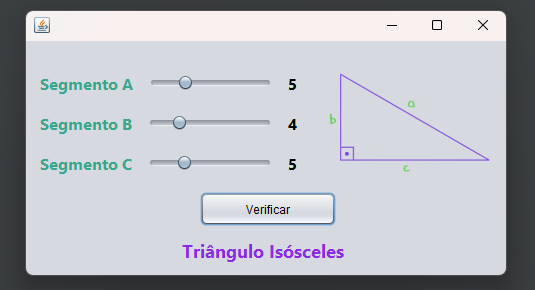

# Verificação de Triângulos

## 📖 Descrição

Este repositório contém um programa em **Java** com interface gráfica que verifica qual é o tipo de triângulo de acordo com os valores passados.

## 🔨 Ferramentas Utilizadas
- Java: Contém a lógica utilizada no programa
- JavaFX: Utilizado para mostrar os resultados na interface

## 💻 Como Usar
Há duas maneiras de utilizar e ver o programa na sua tela. E, para isso, é necessário ter instalado no seu PC o Java Runtime Environment(JRE).

**1ª Maneira: Clonar o Repositório**
- Primeiro, você deve ter instalado a IDE do NetBeans no seu computador.
- Depois disso, basta clonar esse repositório e abrir o projeto no NetBeans.
- Para executar o programa entre em *Source Packages > Classes > TelaTriangulo*. Clique em Run Project no NetBeans ou clique na tecla F6 do seu teclado que o programa será executado.

**2ª Maneira: Baixar o Executável**
- Para baixar o executável entre na pasta `dist` e selecione o arquivo `Triangulo`.
- Faça o download do arquivo e após baixado, clique duas vezes no arquivo que ele será executado.
